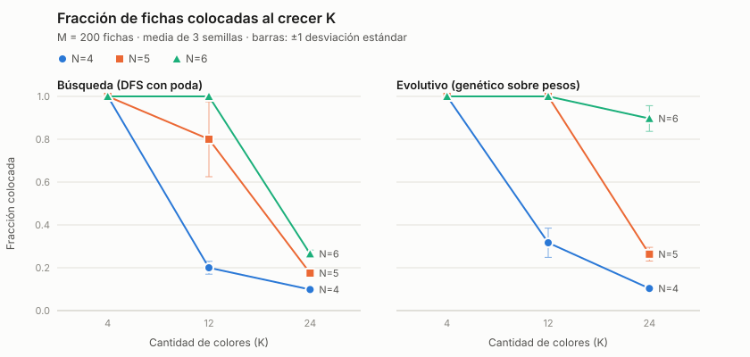
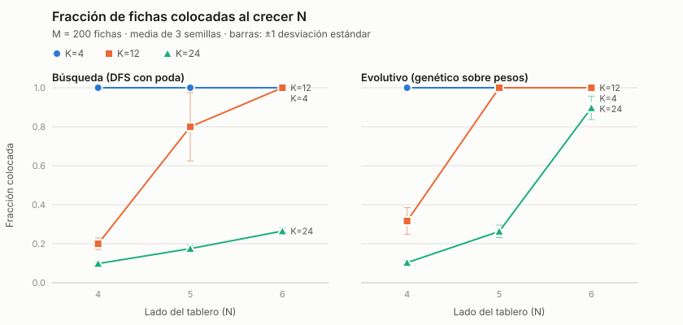
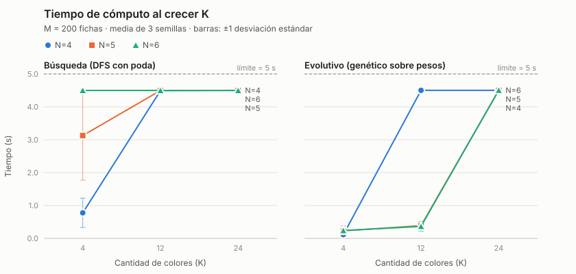

# Resultados de la batería experimental

Generado por `experimentos/bateria.py` a partir de `resultados.csv` (54 corridas válidas). Cada celda es media ± desviación estándar entre semillas. "Corte por tiempo" cuenta las corridas que llegaron al plazo del agente (límite menos el margen de main.py) en lugar de detenerse por un criterio propio.

## Búsqueda (DFS con poda)

| N | K | M | colocadas | fracción colocada | ocupadas | tiempo (s) | esfuerzo | victorias | corte por tiempo |
|---|---|---|---|---|---|---|---|---|---|
| 4 | 4 | 200 | 200.0 ± 0.0 | 1.00 ± 0.00 | 4.0 ± 0.0 | 0.78 ± 0.45 | 10451 ± 6110 | 3/3 | 0/3 |
| 4 | 12 | 200 | 40.0 ± 6.0 | 0.20 ± 0.03 | 16.0 ± 0.0 | 4.49 ± 0.00 | 552405 ± 40634 | 0/3 | 3/3 |
| 4 | 24 | 200 | 19.7 ± 1.2 | 0.10 ± 0.01 | 16.0 ± 0.0 | 4.50 ± 0.00 | 667470 ± 33131 | 0/3 | 3/3 |
| 5 | 4 | 200 | 200.0 ± 0.0 | 1.00 ± 0.00 | 4.0 ± 0.0 | 3.13 ± 1.36 | 34654 ± 13680 | 3/3 | 1/3 |
| 5 | 12 | 200 | 160.0 ± 35.0 | 0.80 ± 0.17 | 21.7 ± 5.8 | 4.50 ± 0.00 | 503764 ± 104667 | 1/3 | 3/3 |
| 5 | 24 | 200 | 35.0 ± 3.5 | 0.17 ± 0.02 | 25.0 ± 0.0 | 4.50 ± 0.00 | 587147 ± 49700 | 0/3 | 3/3 |
| 6 | 4 | 200 | 200.0 ± 0.0 | 1.00 ± 0.00 | 4.0 ± 0.0 | 4.50 ± 0.01 | 34657 ± 1553 | 3/3 | 3/3 |
| 6 | 12 | 200 | 200.0 ± 0.0 | 1.00 ± 0.00 | 24.3 ± 5.1 | 4.50 ± 0.00 | 397988 ± 135575 | 3/3 | 3/3 |
| 6 | 24 | 200 | 53.0 ± 3.5 | 0.27 ± 0.02 | 36.0 ± 0.0 | 4.50 ± 0.00 | 533976 ± 12250 | 0/3 | 3/3 |

Esfuerzo = `nodos_expandidos`.

## Evolutivo (genético sobre pesos)

| N | K | M | colocadas | fracción colocada | ocupadas | tiempo (s) | esfuerzo | victorias | corte por tiempo |
|---|---|---|---|---|---|---|---|---|---|
| 4 | 4 | 200 | 200.0 ± 0.0 | 1.00 ± 0.00 | 4.0 ± 0.0 | 0.11 ± 0.01 | 30 ± 0 | 3/3 | 0/3 |
| 4 | 12 | 200 | 63.3 ± 13.7 | 0.32 ± 0.07 | 16.0 ± 0.0 | 4.50 ± 0.00 | 4476 ± 1001 | 0/3 | 3/3 |
| 4 | 24 | 200 | 20.7 ± 2.1 | 0.10 ± 0.01 | 16.0 ± 0.0 | 4.50 ± 0.00 | 8791 ± 1172 | 0/3 | 3/3 |
| 5 | 4 | 200 | 200.0 ± 0.0 | 1.00 ± 0.00 | 4.0 ± 0.0 | 0.23 ± 0.15 | 40 ± 17 | 3/3 | 0/3 |
| 5 | 12 | 200 | 200.0 ± 0.0 | 1.00 ± 0.00 | 12.0 ± 0.0 | 0.39 ± 0.06 | 130 ± 17 | 3/3 | 0/3 |
| 5 | 24 | 200 | 52.7 ± 6.4 | 0.26 ± 0.03 | 25.0 ± 0.0 | 4.50 ± 0.00 | 2981 ± 462 | 0/3 | 3/3 |
| 6 | 4 | 200 | 200.0 ± 0.0 | 1.00 ± 0.00 | 4.0 ± 0.0 | 0.24 ± 0.02 | 30 ± 0 | 3/3 | 0/3 |
| 6 | 12 | 200 | 200.0 ± 0.0 | 1.00 ± 0.00 | 12.0 ± 0.0 | 0.37 ± 0.15 | 70 ± 17 | 3/3 | 0/3 |
| 6 | 24 | 200 | 179.3 ± 12.0 | 0.90 ± 0.06 | 36.0 ± 0.0 | 4.50 ± 0.00 | 811 ± 30 | 0/3 | 3/3 |

Esfuerzo = `evaluaciones_aptitud`.

## Gráficas

